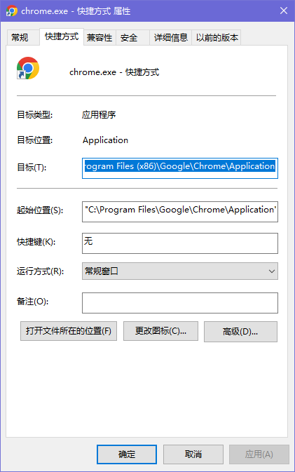
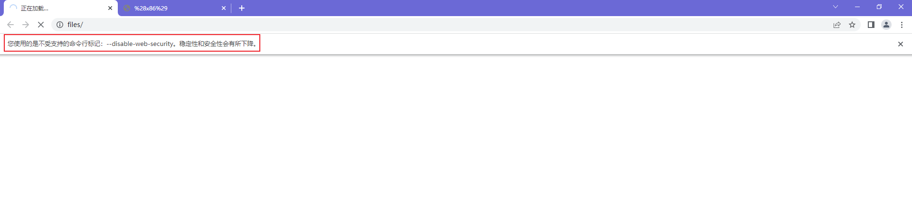

# 浏览器
# 1.临时取消跨域限制
在一些工作场景中可能会出现跨域的情况(例如:对接其他合作公司的接口), 在开发和测试过程中可以先临时取消浏览器的跨域限制,便于开发<br>
Chrome取消跨域限制方法:<br>
1. 新建一个快捷方式
2. 右键-属性-在目标栏中加入以下代码
```bash
    --disable-web-security --user-data-dir=C:\Program Files (x86)\Google\Chrome\Application
```
<br>
通过该快捷方式打开浏览器,出现以下提示即取消跨域限制成功
