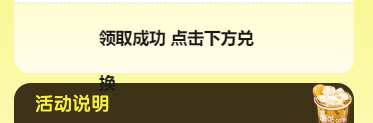
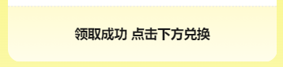
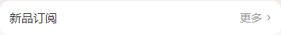

# css
## 1.颜色值设为透明
```css
color: transparent
```
## 2.设置渐变色背景
详见：[MDN-CSS渐变](https://developer.mozilla.org/zh-CN/docs/Web/CSS/CSS_Images/Using_CSS_gradients)
```css
/* 从上往下线性渐变 */
background: linear-gradient(color1 , color2, colorN);
```

## 3.position居中解决方案
```css
/* 容器宽高未知 */
.container {
    position: absolute;
    top: 50%;
    left: 50%;
    transform:translate(-50%,-50%);
}
```
还有一种情况, 容器内文字过多可能会导致自动换行,不能达到我们想要的效果(如图)



可以通过white-space属性强制不换行
```css
.container {
    white-space: nowrap;
}

```


## 4.移动端单元格解决方案
类似效果:<br>

```html
<div class="container">
    <div class="left-img"></div>
    <div class="center-info"></div>
    <div class="right-icon"></div>
</div>
<style lang="scss">
    .container {
        display: flex;
        justify-content: space-between;
        .left-img {
            /* 定宽高 */
        }
        .center-info {
            /* 两边定宽 中间可以实现宽度自适应 */
            flex: 1;
            width: 100%;
        }
        .right-icon {
            /* 定宽高 */
        } 
    }
</style>
```

## 5.设置小于12px字体大小
```css
/* 
10px -> 10 / 12 = 0.8333
8px  ->  8 / 12 = 0.6667
*/

font-size: 12px;
transform: scale(0.91,0.91);
```