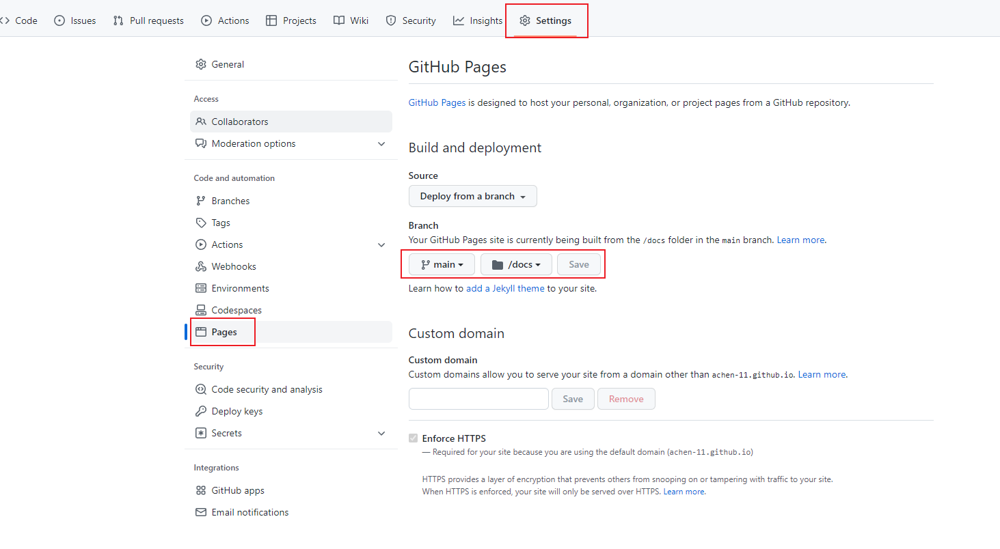
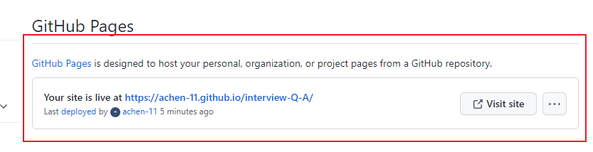

# GitHub

# 1.部署一个GitHub Page
1. 上传代码到github
> 详见: [docsify部署到GitHub Page](https://jingping-ye.github.io/docsify-docs-zh/#/%E6%8C%87%E5%8D%97/%E9%83%A8%E7%BD%B2)

GitHub Pages 支持从三个地方读取文件

- docs/ 目录
- master 分支
- gh-pages 分支

推荐直接将文档放在 docs/ 目录下，在设置页面开启 GitHub Pages 功能并选择 master branch /docs folder 选项。

> 可以将文档放在根目录下，然后选择 master 分支 作为文档目录。你需要在部署位置下放一个 .nojekyll 文件（比如 /docs 目录或者 gh-pages 分支）

2. 配置github pages  

3. 配置成功, 刷新页面  
