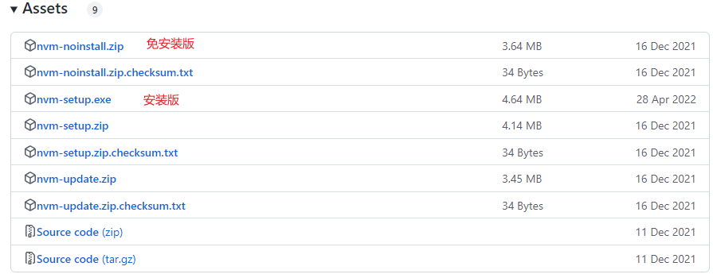
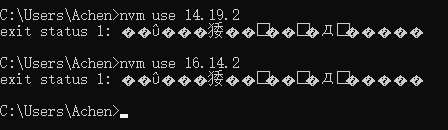
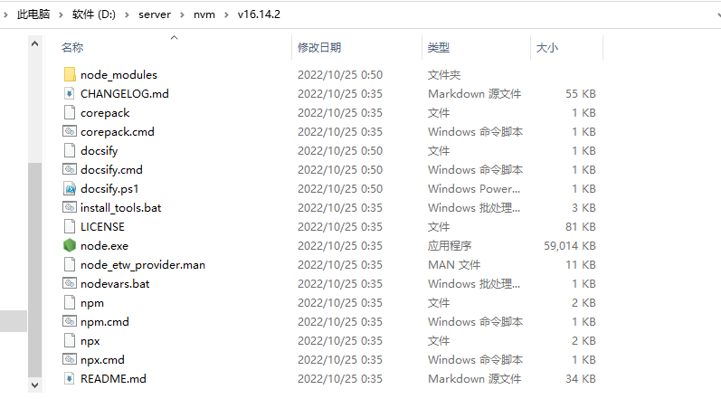

# node版本控制工具--nvm
## 1. 安装nvm
github地址: https://github.com/coreybutler/nvm-windows/releases


根据提示安装即可(最好安装最新版) <br>
最新版为`1.19`, 安装`1.17`版切换node时会出现只安装了node,没有安装npm的情况---(update: 2022.10.25)
## 2. 常用命令
```bash
nvm version        # 查看nvm版本
nvm list           # 查看本地安装的node版本
nvm use xxx        # 切换node到xxx版本
nvm install xxx    # 下载node的xxx版本
nvm uninstall xxx  # 删除node的xxx版本
```
## 3.更换代理
在nvm的安装目录下找到`seeting.txt`文件,添加以下代码即可
```bash
node_mirror: https://npm.taobao.org/mirrors/node/
npm_mirror: https://npm.taobao.org/mirrors/npm/
```
## 4.切换版本时报错\乱码


以管理员方式运行cmd再执行切换函数即可

## 5. 安装nvm后出现npm失效的情况
最简单的方法是下载**最新版的nvm**, `1.19`没有出现这种情况,`1.17`会出现npm失效的情况<br>
原因是install时没有下载安装对应版本的npm

其他解决方法:<br>
1. 到官网查看node对应版本的npm [查看地址](https://nodejs.org/zh-cn/download/releases/)
2. 下载对应的npm [下载地址](https://registry.npmmirror.com/binary.html?path=npm/)
3. 解压到对应版本的目录下 <br>
