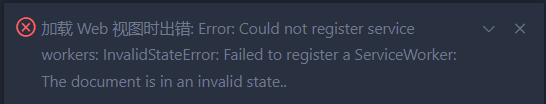

#
# 1.解决vscode加载Web视图报错
 
> 加载Web视图时出错:Error: Could not register serviceworkers: InvalidStateError: Failed to register a ServiceWorker:The document is in an invalid state.. 

解决方案:
关闭vscode -> 打开cmd -> 输入`code --no-sandbox` -> 打开vscode重试即可解决
